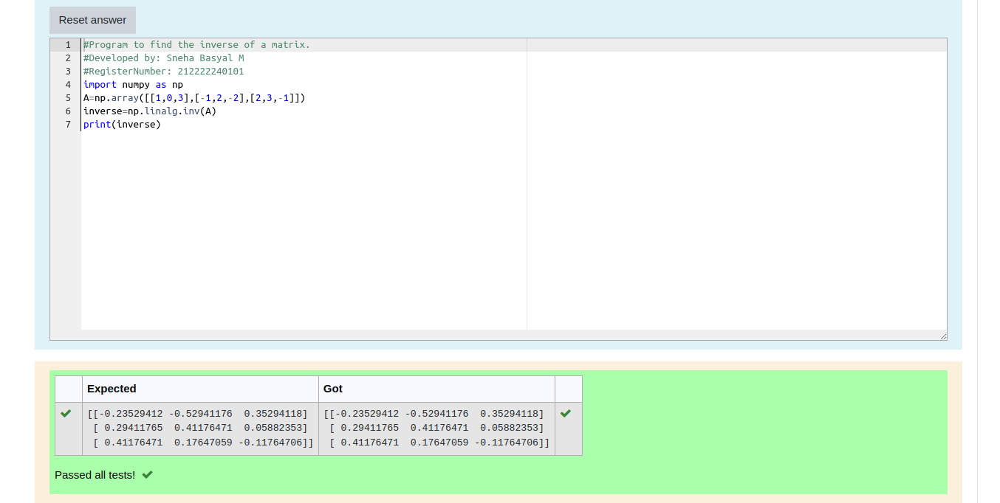

# INVERSE-OF-A-MATRIX
## Aim:
To write a python program to find the inverse of a matrix

## Equipment’s required:
1. 	Hardware – PCs
2. 	Anaconda – Python 3.7 Installation / Moodle-Code Runner

## Algorithm:
### Step1 : 
Import numpy as np
### Step 2: 
Assign the values of the matrix to a variable using np.array
### Step 3: 
Using np.linalg.inv() the inverse of a matrix can be found
### Step 4: 
Print the inverse

## Program:
```
#Program to find the inverse of a matrix.
#Developed by: Sneha Basyal M
#RegisterNumber: 212222240101

import numpy as np
A=np.array([[1,0,3],[-1,2,-2],[2,3,-1]])
inverse=np.linalg.inv(A)
print(inverse)
```

## Output:


## Result:
Thus the inverse of a given matrix is successfully solved using python program

